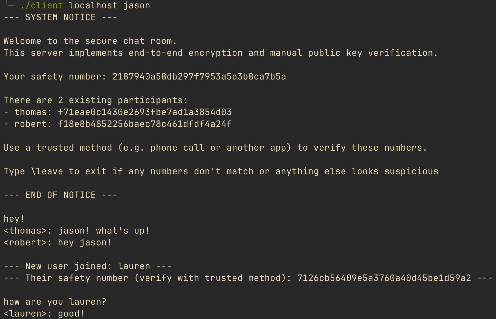

<!-- ABOUT THE PROJECT -->
## About The Project



A secure, lightweight chat room server written in C that enables end-to-end encrypted communication between users.
This project harnesses the socket API to connect users through TCP sockets. 
Furthermore, it implements strong security features to ensure user and message authenticity. 

This project separates itself from conventional end-to-end encrypted messaging because instead of messaging between two users, messages are broadcasted (but must be encrypted individually) to a group of users.


### Features
- **Public Key Verification**  
  When a new user joins, their public key fingerprint is displayed as a human-readable hash for manual verification. Users are prompted to use another form of communication to verify the transmitted public key matches that of the new user. This is similar to Signal's "safety number" feature.

- **Peer-to-Peer Key Exchange**  
  Secure Diffie-Hellman key exchanges are performed between every pair of users. This ensures that messages between users are encrypted and decrypted using a unique shared secret key. 

- **End-to-End Encryption**  
  When a user sends a message, the sender encrypts it and sends a packet separately for each receiptient. The encryption key is the result of the Diffie-Hellman key exchange between the sender and receiptient. Since the server does not play a role in the key exchange, it simply acts as a packet relay and cannot decrypt messages.


### Custom Packet Protocol
  Clients transmit information to the server through a custom-defined packet structure. It supports message delivery and users connecting and disconnecting.

```
message_packet {
  char sender[];
  char receiptient[];
  unsigned char nonce[];
  uint32_t len;
  unsigned char message[];
}

hello_packet {
  uint32_t user_status; // NEW_USER or EXISTING_USER
  char username[];
  unsigned char public_key[];
  unsigned char id_public_key[];
  unsigned char signature[];
}

goodbye_packet {
  char username[];
};

serv_info_packet {
  uint32_t num_users;
};
```


## Getting Started

### Prerequisites

- GCC
- [libsodium](https://libsodium.gitbook.io/doc/) (cryptographic library)

### Installation

1. Clone the repo
   ```sh
   git clone https://github.com/THuitema/SecureChatRoomServer.git
   ```
2. If you installed libsodium using Homebrew, skip this step. Otherwise, you will need to edit CFLAGS and LDFLAGS. 
  
  Edit the Makefile accordingly:
  
   ```sh
    # Replace these:
    CFLAGS = -g -Wall -I/opt/homebrew/include
    LDFLAGS = -L/opt/homebrew/lib -lsodium

    # With (Debian/Ubuntu):
    CFLAGS = -g -Wall
    LDFLAGS = -lsodium

    # With (other systems or installed to custom location):
    CFLAGS = -g -Wall -I/path/to/libsodium/include
    LDFLAGS = -L/path/to/libsodium/lib -lsodium
   ```

3. Compile using the Makefile
   ```sh
   make
   ```
   This builds both `client` and `server` binaries

4. Start the server. By default, it runs on port 3050. You change change this in `protocol.h` with the `PORT` macro.
    ```sh
    ./server
    ```
5. Create user(s). Create a separate terminal instance for each one if running everything locally.
    ```sh
    ./client [hostname] [username]
    ```
   `[hostname]` is the hostname of the machine running `server`. If running locally, replace `[hostname]` with `localhost`.
